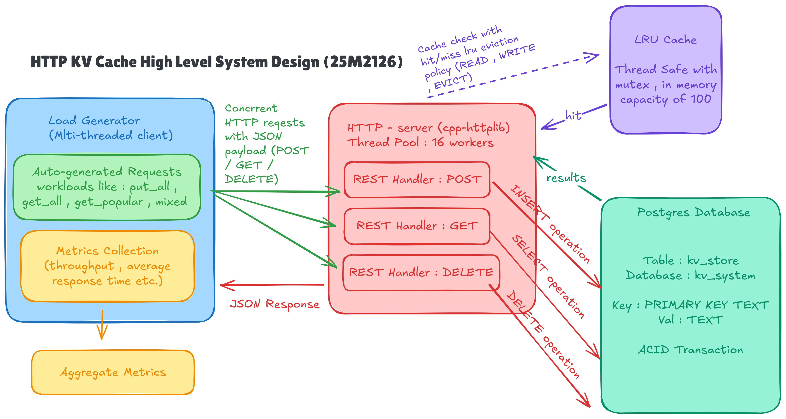

# HTTP KV Cache Server docs/architecture.md

# System Architecture

This document outlines the high-level design of the HTTP KV Cache Server, focusing on the three core components: the multi-threaded HTTP server (with in-memory cache), the PostgreSQL database, and the load generator client. The design emphasizes performance (via caching and concurrency), persistence (via DB), and benchmarkability (via automated loads). It adheres to the project requirements: RESTful APIs, LRU eviction, concurrent request handling, and workload-driven testing.

## Overview
- **Components**:
  1. **Load Generator (Client)**: Emulates concurrent clients; generates self-contained requests.
  2. **HTTP Server**: Thread-pooled request handler with LRU cache.
  3. **PostgreSQL Database**: Persistent KV store.
- **Interactions**: Clients → HTTP requests → Server (cache check → DB if miss) → Response. All writes sync to DB + cache; deletes sync both.
- **Key Goals**: Reduce DB latency with cache (hit rate >80% in "get popular"), handle 1000+ req/s under load, identify bottlenecks (e.g., disk/CPU).
- **Assumptions**: Linux environment; network-isolated testing; no auth (for simplicity).

## Component Details

###  HTTP Server (`server.cpp` + `cache.cpp`)
A lightweight, multi-threaded server using `cpp-httplib` for HTTP handling. Listens on TCP 8080; processes requests via a thread pool (16 workers default).

**Request Flow**:
1. **Ingress**: httplib parses HTTP → Dispatches to handler (thread from pool).
2. **Cache Check** (LRUCache, capacity 100):
   - **Read**: `cache.get(key)` → Hit? Return immediately. Miss? DB fetch → `cache.put(key, value)` (evict LRU if full).
   - **Create**: `db_create(key, value)` → If success, `cache.put(key, value)` (evict if full).
   - **Delete**: `db_delete(key)` → If success, `cache.remove(key)`.
3. **DB Sync**: All ops use transactions (pqxx::work/nontransaction).
4. **Egress**: JSON response (200/201/404/500) with source (cache/DB).

**RESTful Endpoints**:
| Method | Path       | Body/Params          | Behavior                  |
|--------|------------|----------------------|---------------------------|
| POST   | /kv       | JSON `{"key":str, "value":str}` | Create (cache + DB)      |
| GET    | /kv/<key> | -                    | Read (cache → DB if miss)|
| DELETE | /kv/<key> | -                    | Delete (DB + cache)      |

**Concurrency & Safety**:
- Thread pool: httplib::ThreadPool for I/O-bound ops.
- Cache: Thread-safe LRU (std::unordered_map + std::list for O(1) ops; mutex-protected).
- DB: Per-request connections (pooled via pqxx); transactions for consistency.

**Eviction Policy**: LRU (Least Recently Used) – On put (full): Move to front on access; evict tail.

### 3. PostgreSQL Database
Standalone relational DB as KV store (table: `kv_store` with TEXT key/value, PRIMARY KEY on key).

**Operations**:
- **Create**: `INSERT ... ON CONFLICT UPDATE` (upsert).
- **Read**: `SELECT value WHERE key=$1`.
- **Delete**: `DELETE WHERE key=$1`; returns affected rows.

**Integration**: libpqxx for C++ bindings; connection string in server.cpp. No in-process DB (e.g., no SQLite).

**Tuning for Perf**: Indexes on key; WAL mode for writes; monitor via `pg_stat_statements`.

## Data Flow Diagram
